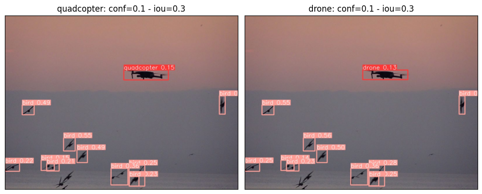

# Drone Detection Using YOLO-World
---------------------------------------------------

This repository contains code for Drone (Quadcopter) detection using YOLO-World.

YOLO-World is the next generation of large models in computer vision by offering state-of-the-art capabilities in real-time open-vocabulary object detection.

You can access additional details by visiting the following [ultralytics](https://docs.ultralytics.com/models/yolo-world/)
 

